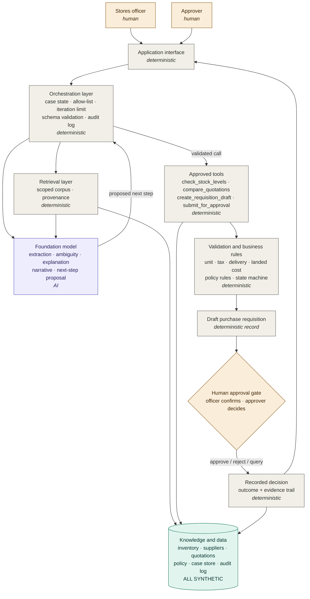

# Week 1 Architecture and Context Design

> Week 1 deliverable, BSE4104. An *initial* architecture is required this week, not a final one.
> It is expected to change as Weeks 2-6 add the model, retrieval, tools, agency and memory.

## What this document is

An **architecture diagram** shows the internal parts of the system and how they connect. A **context diagram** shows the system as one box, surrounded by the people and data sources outside it. Week 1 needs something between the two: enough internal structure to show where the model sits and where control stays deterministic, without pretending to a design we have not built yet.

Legend used throughout: **[H]** human, **[D]** deterministic software, **[AI]** foundation model, **[K]** data or knowledge.

---

## 1. ASCII architecture

Two views. **Diagram A** shows what happens, in order — read it top to bottom like a story. **Diagram B** shows who is allowed to talk to whom, which is the part that makes the agent bounded. Together they say everything the Week 1 architecture needs to say.

Legend, used in both: **[H]** human · **[D]** deterministic software · **[AI]** foundation model · **[K]** data / knowledge

### Diagram A — the journey of one requisition

```
  (1)  [H] OFFICER
       "reorder cement, about 200 bags" + the quotations received
                          |
                          v
  (2)  [D] INTERFACE + ORCHESTRATOR
       opens the case, validates the input, starts the bounded loop
       (rejects a bad quantity or unknown item BEFORE any model call)
                          |
                          v
  (3)  [AI] MODEL reads
       - the quotation letters  -> extracts supplier, unit, price,
                                   VAT, delivery, validity dates
       - the policy passages    -> explains which rules apply
       - anything unclear?      -> ASKS, never assumes
                          |
                          |  extracted fields handed back
                          |  to the orchestrator
                          v
  (4)  [D] TOOLS + RULES do the maths
       convert units -> add VAT -> add delivery -> landed cost
       check: 3-quote rule, thresholds, excluded suppliers, validity
       -> RANKED COMPARISON TABLE + POLICY FLAGS
          (every number here is computed in code, never by the model)
                          |
                          v
  (5)  [AI] MODEL writes the justification
       words only - it explains the table, it does not produce figures
                          |
                          v
  (6)  [D] DRAFT REQUISITION created           state = DRAFT
                          |
                          v
  (7)  [H] OFFICER confirms the supplier       state = PENDING_APPROVAL
                          |
                          v
  (8)  [H] APPROVER approves / rejects / queries
                          |
                          v
  (9)  [D] DECISION RECORDED
       outcome + comparison + flags + citations + who decided, when
       state = APPROVED | REJECTED | QUERIED

       STOP. Nothing further happens. No order is placed.
```

### Diagram B — who may talk to whom

```
  +==========================================================+
  |                    SYSTEM BOUNDARY                       |
  |                                                          |
  |                  +--------------------+                  |
  |   [AI] MODEL <-->|  [D] ORCHESTRATOR  |<--> [D] TOOLS    |
  |                  |                    |                  |
  |   proposes       |  THE CONTROL POINT |     the only     |
  |   never acts     |  - holds case state|     four actions |
  |                  |  - checks allow-   |     that exist   |
  |                  |    list            |                  |
  |                  |  - counts loops    |                  |
  |                  |  - validates schema|                  |
  |                  |  - writes audit log|                  |
  |                  +---------+----------+                  |
  |                            |                             |
  |                            v                             |
  |                  [K] SYNTHETIC DATA + CORPUS             |
  |                  inventory | suppliers | quotations      |
  |                  policy | case store | audit log         |
  +==========================================================+
             ^                                  |
             | in                               | out
             |                                  v
      [H] OFFICER                         [H] APPROVER
      opens case, confirms                approves / rejects / queries


  THE TWO RULES THIS PICTURE ENFORCES
  1. The model has exactly one connection: to the orchestrator.
     It cannot call a tool or read the database itself. It proposes;
     the orchestrator checks the proposal, then acts.
  2. Nothing crosses the boundary except the two humans.

  NOT CONNECTED, BECAUSE THEY DO NOT EXIST IN THE CODE:
     supplier channel | purchase order | payment interface
     bank or mobile money | external API | web browser
```

## 2. Component reference

| Component | Type | Purpose | Inputs | Outputs |
|---|---|---|---|---|
| Stores officer | [H] | Opens the case, supplies quotations, confirms the supplier, submits | Case package for review | Item, quantity, quotations, confirmation |
| Approver | [H] | Single decision on a submitted requisition | Requisition with comparison, flags, citations | Approve / reject / query with reason |
| Application interface | [D] | Presents the case and collects human input | Human actions; case state | Rendered case; validated actions |
| Orchestration layer | [D] | The control point of the whole system: holds case state, enforces the allow-list and iteration limit, validates schemas, writes the audit log | Human actions, model proposals, tool results | Prompts with context, validated tool calls, audit entries |
| Foundation model | [AI] | Extraction, ambiguity detection, grounded explanation, narrative drafting, next-step proposal | Prompt with retrieved context and case state | Extracted fields, questions, explanations, narrative, proposed next step |
| Retrieval layer | [D] | Scoped retrieval from the approved corpus with provenance | Query from orchestration | Passages with source identifiers |
| Approved tools | [D] | The only four actions the agent may take | Validated arguments | Structured results against schema |
| Validation and business rules | [D] | All arithmetic and every policy rule; the state machine | Canonical records, case value, supplier status | Computed comparison, policy flags, permitted transitions |
| Draft purchase requisition | [D] | The artefact produced, with its state | Confirmed supplier, case evidence | Requisition record and state |
| Human approval gate | [H] | Two mandatory decisions: officer confirmation, approver decision | Case package | Recorded human decision |
| Recorded decision | [D] | Immutable outcome with full evidence trail | Human decision | Audit trail, persisted case |
| Knowledge and data | [K] | Synthetic corpus and records | Team authoring | Records and documents for retrieval and computation |

## 3. Connections that matter

Three points an examiner is likely to probe, so every member should be able to state them:

1. **The model never touches the tools directly.** It proposes; the orchestration layer checks the proposal against the allow-list and the schema, then executes. That single indirection is what makes the agency bounded — it is the one connection shown in Diagram B.
2. **The model never touches the data store.** It receives retrieved passages and case state as context, and cannot read or write records. All persistence is deterministic.
3. **No arrow leaves the system boundary toward a supplier, bank or external service.** The only outputs are to the two human roles and to the internal record.

## 4. Mermaid source

Paste into any Mermaid renderer (mermaid.live, VS Code Mermaid preview, or a GitHub markdown file, which renders it natively) and export as PNG into `evidence/screenshots/`.



## 5. Producing the visual file

Free options, in order of least effort:

1. **GitHub itself** — commit this file; GitHub renders the Mermaid block automatically. Screenshot the rendered diagram for `evidence/screenshots/`.
2. **mermaid.live** — paste the block, export PNG or SVG, save as `docs/architecture/week1-context-diagram.png`.
3. **draw.io (app.diagrams.net)** — if the group prefers hand-drawn boxes: create one box per row of the component reference table above, colour by type using the legend, and draw only the arrows listed in section 4. Keep the four "not present" capabilities off the canvas entirely; a crossed-out payment box invites the question of whether the code contains one.

Keep the diagram to the components above. Adding a queue, a cache or a microservice split that does not exist would misrepresent the system.
