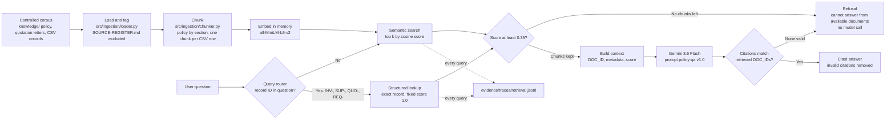

# Week 3 RAG Architecture

The diagram shows the retrieval path that actually runs when `answer_query()` is called (`src/rag/answer.py`). It was checked against the code on 27 Sep 2026.

## Components

| Step | Code | Type | Notes |
|---|---|---|---|
| Load and tag | `src/ingestion/loader.py` | Deterministic | Loads every `.md` and `.csv` under `knowledge/` except `SOURCE-REGISTER.md`, which is provenance, not evidence |
| Chunk | `src/ingestion/chunker.py` | Deterministic | Policy is split by `##` section, and the section name is kept in the chunk metadata. Quotation letters stay whole. Each CSV row is one chunk |
| Embed and search | `src/retrieval/semantic_search.py` | Local model | `all-MiniLM-L6-v2` runs on the machine and holds the index in memory. No data leaves the machine |
| Route | `src/retrieval/query_router.py` | Deterministic | Questions containing a record ID go to exact structured lookup (`src/retrieval/structured_lookup.py`) |
| Threshold and trace | `src/rag/retrieve.py` | Deterministic | Drops chunks below 0.35 and logs every query to `evidence/traces/retrieval.jsonl` |
| Answer | `src/rag/answer.py` + `prompts/policy-qa/v1.0.md` | AI (Gemini) | The model sees only retrieved chunks |
| Citation check | `src/rag/answer.py` | Deterministic | Removes citations the model made up. An answer with no valid citation becomes a refusal |

`src/rag/ingest.py` also builds a SQLite index of the same corpus, with line ranges, for inspection. The live path above does not use it.

## Known limits (from the W3-07 evaluation)

These are recorded in `docs/evaluation/week3-retrieval-failures.md`:

1. **Citations stop at the file.** The section is kept in the chunk metadata but dropped before the citation is returned.
2. **The 0.35 threshold rarely refuses by itself.** Irrelevant chunks for unanswerable questions scored 0.40–0.51, so those questions were refused by the model, not the gate.
3. **Structured lookups skip the threshold,** because every structured result gets a fixed score of 1.0.

The image `week3-rag-diagram.png` shows the earlier design, which used a SQLite FTS5 index. The diagram in this file is the current one.
