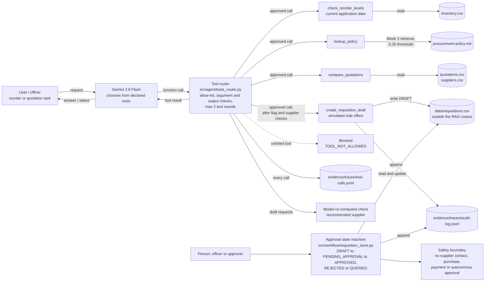

# Week 4 Architecture — Tools and Function Calling

This is the text version of `week4-architecture.png` (Tendo Caisey). It was first checked against the code on 27 Sep 2026, when several components were still planned. The gaps found then were fixed on 7 Oct 2026, and this version was checked again against `src/agent/tools_router.py`, `src/tools/`, and `src/workflow/` on that date. `week4-architecture.png` was regenerated from the Mermaid source below on 7 Oct 2026, replacing Tendo's original (kept in git history). Tool contracts are defined in `tool-catalogue.md`.

The approval state machine is reached only by a person. It is not registered as a model tool.

## Build status

| Component | Code | Status | Notes |
|---|---|---|---|
| Foundation model with tools | `call_model_with_tools()` in `src/model_client.py` | Built | Gemini function calling with the four declared schemas |
| Tool router: allow-list | `dispatch_tool()` | Built | Unlisted tools return `TOOL_NOT_ALLOWED` and are never executed |
| Tool router: argument checks | `_validate_arguments()` | Built | Missing or unexpected arguments are checked against the schema before dispatch (`TOOL_ARGUMENT_ERROR`); tool crashes return `TOOL_EXECUTION_ERROR` |
| Tool router: output checks | `_validate_output()` | Built | Output that is not JSON, is missing a contract field, or reports a draft in any state other than `DRAFT` is rejected with `TOOL_OUTPUT_INVALID`, naming the field |
| Bounded loop | `run_bounded_tool_agent(max_tool_rounds=2)` | Built | Stops with `MAX_TOOL_ROUNDS_EXCEEDED` |
| `check_reorder_levels` (current application data) | `src/tools/procurement.py` | Built | Reads live stock from `inventory.csv`; flags items strictly below the reorder level (US-01) |
| `compare_quotations` | `src/tools/procurement.py` | Built | Landed cost, validity, exclusion, approval level, and the 2% lead-time tie-break from policy §3.4 |
| `lookup_policy` | `src/tools/policy.py` | Built | Week 3 retriever over the policy document; returns section, rule and source, or the Week 3 refusal |
| `create_requisition_draft` (simulated side effect) | `src/tools/procurement.py` | Built | Writes a `DRAFT` to `data/requisitions.csv` and an audit event. The router recomputes the comparison and refuses on blocking flags (`POLICY_BLOCKING_FLAGS`) |
| Model-vs-computed check | `check_model_vs_computed()` | Built | Run on every draft request: the model's supplier must match the computed recommendation (`MODEL_VALUE_MISMATCH`). Results are returned as `model_checks` |
| Tracing | `_write_tool_trace()` | Built | Every tool call is appended to `evidence/traces/tool-calls.jsonl` with a run ID |
| Human approval gate | `src/workflow/state_machine.py`, `requisition_store.py` | Built | Persists submit, approve, reject and query on `data/requisitions.csv` with audit events. There is no path from `DRAFT` straight to `APPROVED`. State machine awaiting review by its assigned owner (Isaac) |
| Safety boundary | Whole design | Holds | No tool can contact a supplier, purchase, pay or approve |

## Where AI stops and code takes over

| Decision | Made by |
|---|---|
| Which tool to request | Model |
| Whether the tool may run | Router (allow-list and argument checks) |
| Stock levels, landed costs, quotation validity, approval level, recommended supplier | Deterministic code |
| Whether a draft may be created | Router: recomputed blocking flags and supplier check |
| Creating a `DRAFT` | Code, on the model's request |
| Submitting, approving, rejecting or querying a requisition | A person, through the state machine |
