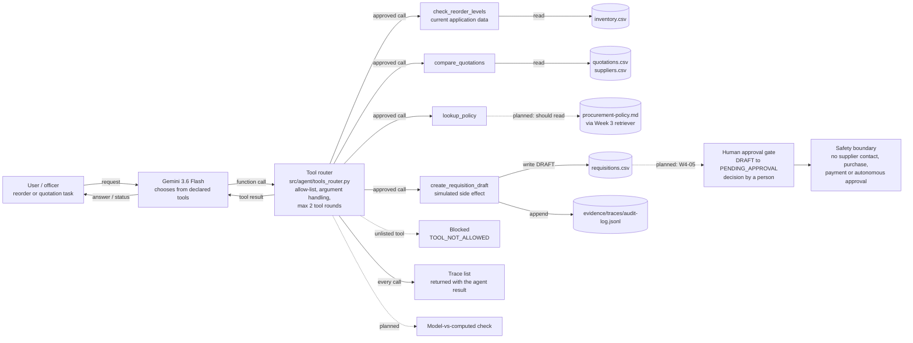

# Week 4 Architecture — Tools and Function Calling

This is the text version of `week4-architecture.png` (Tendo Caisey). It shows the same design, marks which parts are **built** and which are **planned**, and was checked against `src/agent/tools_router.py` and `src/tools/procurement.py` on 27 Sep 2026. Tool contracts are defined in `tool-catalogue.md`.

Solid lines are built. Dotted lines are planned or not yet wired in.

## Build status

| Component | Code | Status | Notes |
|---|---|---|---|
| Foundation model with tools | `call_model_with_tools()` in `src/model_client.py` | Built | Gemini function calling with the four declared schemas |
| Tool router: allow-list | `dispatch_tool()` | Built | Unlisted tools return `TOOL_NOT_ALLOWED` and are never executed |
| Tool router: argument handling | `dispatch_tool()` | Built | Bad arguments return `TOOL_ARGUMENT_ERROR`, tool crashes return `TOOL_EXECUTION_ERROR` |
| Bounded loop | `run_bounded_tool_agent(max_tool_rounds=2)` | Built | Stops with `MAX_TOOL_ROUNDS_EXCEEDED` |
| `check_reorder_levels` (current application data) | `src/tools/procurement.py` | Built | Reads live stock from `inventory.csv` |
| `compare_quotations` | `src/tools/procurement.py` | Built | Landed cost, validity, exclusion, approval level |
| `lookup_policy` | Router maps it to `policy_check()` | **Does not meet contract** | Takes a case value, not a topic, and never reads the policy corpus (see `tool-catalogue.md` §4) |
| `create_requisition_draft` (simulated side effect) | `src/tools/procurement.py` | Built, with gaps | Writes a `DRAFT` row and audit event. Router does not pass blocking flags, and drafts go into the RAG corpus file (`tool-catalogue.md` §6) |
| Tracing | `trace` list in the agent result | Partly built | Every call is recorded, but only in memory. Nothing is written to a file, unlike Week 3's `retrieval.jsonl`, so there is no lasting evidence of tool calls |
| Model-vs-computed check | `check_model_vs_computed()` | **Not wired in** | Function exists and is tested, but `run_bounded_tool_agent` never calls it |
| Human approval gate | — | **Planned (W4-05)** | No `PENDING_APPROVAL` / `APPROVED` state machine exists in `src/` yet |
| Safety boundary | Whole design | Holds | No tool can contact a supplier, purchase, pay or approve |

## Where AI stops and code takes over

| Decision | Made by |
|---|---|
| Which tool to request | Model |
| Whether the tool may run | Router (allow-list) |
| Stock levels, landed costs, quotation validity, approval level | Deterministic code |
| Creating a `DRAFT` | Code, on the model's request |
| Confirming the supplier and approving the requisition | A person (planned W4-05) |
